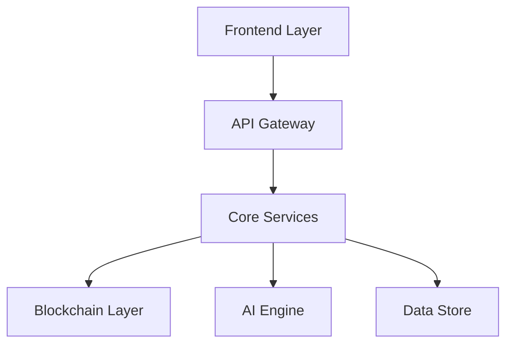

# Crate Base - Core Infrastructure for AI-Powered Solana Workspace

Crate Base is the foundational infrastructure powering Crate's drag-and-drop DeFi application on the Solana blockchain. This repository contains the core components that enable workflow automation, AI integration, and seamless tool connectivity.

## Features

- **AI-Powered Automation**: Simplify complex blockchain operations
- **Drag-and-Drop Interface**: Create custom workflows by connecting various tools and services
- **Solana Integration**: Experience fast and secure transactions with Solana
- **Customizable Workspaces**: Tailor your workspace to fit your specific needs
- **High-Performance Core**: Built with Rust for critical performance components
- **Scalable Architecture**: Microservices-based design for optimal scaling
- **Real-time Updates**: WebSocket integration for live data and notifications
- **Security-First Design**: Enterprise-grade security measures throughout

## Architecture



## Technology Stack

### Frontend
- Next.js for the web application
- TailwindCSS for styling
- SWR for data fetching
- Framer Motion for animations

### Backend
- Go for microservices
- Rust for performance-critical components
- gRPC for service communication
- Redis for caching
- PostgreSQL for persistent storage

### Blockchain
- Solana Web3.js
- Anchor Framework
- Custom SPL tokens

## Getting Started

### Prerequisites

- [Solana Wallet](https://solana.com/wallets)
- [Node.js](https://nodejs.org/) (v18 or higher)
- [Go](https://golang.org/) (1.19 or higher)
- [Rust](https://www.rust-lang.org/) (latest stable)
- [Docker](https://www.docker.com/) and Docker Compose

### Installation

1. **Clone the Repository:**
```bash
git clone https://github.com/crate-lol/crate-base.git
cd crate-base
```

2. **Install Dependencies:**
```bash
# Install frontend dependencies
cd frontend
npm install

# Install Rust dependencies
cd ../rust
cargo build

# Install Go dependencies
cd ../services
go mod download
```

3. **Set Up Environment:**
```bash
# Copy example environment files
cp .env.example .env
cp config/config.example.yaml config/config.yaml

# Configure your environment variables
nano .env
```

4. **Start Development Environment:**
```bash
# Start all services using Docker Compose
docker-compose up -d

# Start frontend development server
cd frontend
npm run dev
```

## Project Structure

```
crate-base/
├── frontend/           # Next.js frontend application
├── rust/              # Rust performance components
│   ├── core/          # Core blockchain operations
│   └── ai/            # AI integration layer
├── services/          # Go microservices
│   ├── api/          # Main API service
│   ├── auth/         # Authentication service
│   └── executor/     # Workflow executor
├── proto/             # Protocol buffer definitions
├── scripts/           # Development and deployment scripts
└── docker/            # Docker configurations
```

## Development

### Running Tests

```bash
# Run frontend tests
cd frontend
npm test

# Run Rust tests
cd rust
cargo test

# Run Go tests
cd services
go test ./...
```

### Code Quality

```bash
# Frontend linting
npm run lint

# Rust formatting
cargo fmt

# Go formatting
go fmt ./...
```

## API Documentation

Our API documentation is available at:
- [REST API Docs](https://crate.lol/docs)
- GraphQL Playground

## Contributing

We welcome contributions! Please see our [Contributing Guide](CONTRIBUTING.md) for details.

1. Fork the repository
2. Create your feature branch (`git checkout -b feature/amazing-feature`)
3. Commit your changes (`git commit -m 'feat: Add amazing feature'`)
4. Push to the branch (`git push origin feature/amazing-feature`)
5. Open a Pull Request

## License

This project is licensed under the MIT License - see the [LICENSE](LICENSE) file for details.

## Support

- Follow us on [Twitter](https://twitter.com/crate_ai)
- Email: support@crate.lol

---

<p align="center">
Made with ❤️ by the Crate team
</p>
